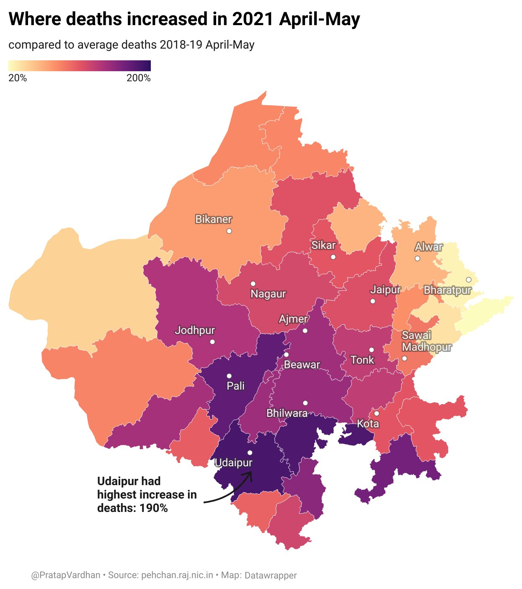

## Rajasthan Mortality

Death registration data between 2018-2021 for Rajasthan from [Pehchan portal](https://pehchan.raj.nic.in/)

*Note: Pehchan has lower registered deaths compared to CRS report. This data might cover entire data accurately.*

Data files
- [rajasthan-pehchan-state-mortality-2018-2021.csv](rajasthan-pehchan-state-mortality-2018-2021.csv)
- [rajasthan-pehchan-districts-mortality-2018-2021.csv](rajasthan-pehchan-districts-mortality-2018-2021.csv)
- Pivot view
  - [rajasthan-pehchan-state-mortality-2018-2021-pivot.csv](rajasthan-pehchan-state-mortality-2018-2021-pivot.csv)
  - [rajasthan-pehchan-districts-mortality-2018-2021-pivot.csv](rajasthan-pehchan-districts-mortality-2018-2021-pivot.csv)

### Media

News stories using this data

- [Excess deaths in Rajasthan are at least five times the official COVID-19 tally](https://www.thehindu.com/news/national/excess-deaths-in-rajasthan-are-five-times-the-official-covid-19-tally/article35118826.ece) - Srinivasan Ramani, The Hindu

---

Reach out to [Pratap Vardhan](https://pratapvardhan.com/) if you've any questions.